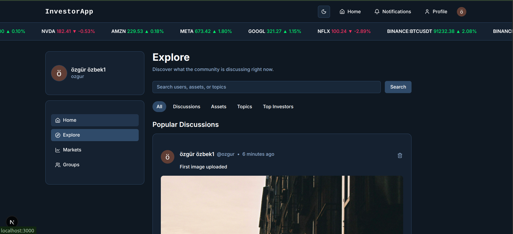
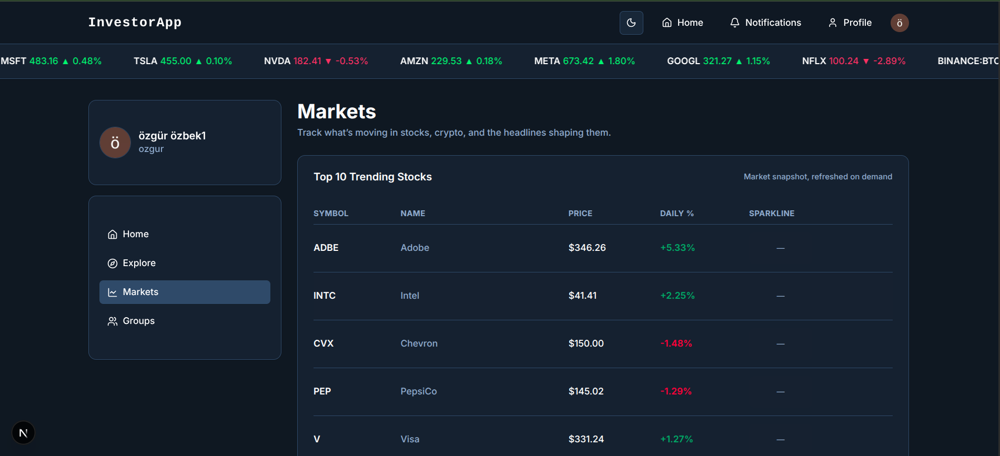
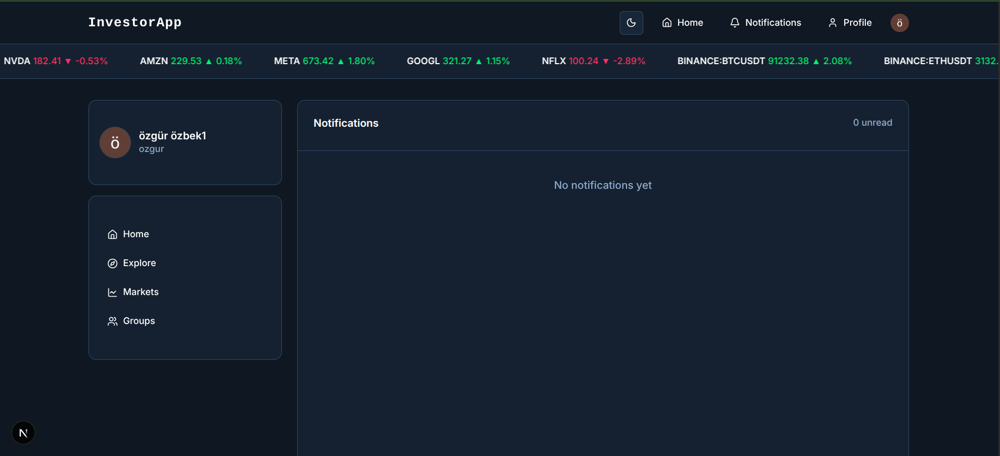
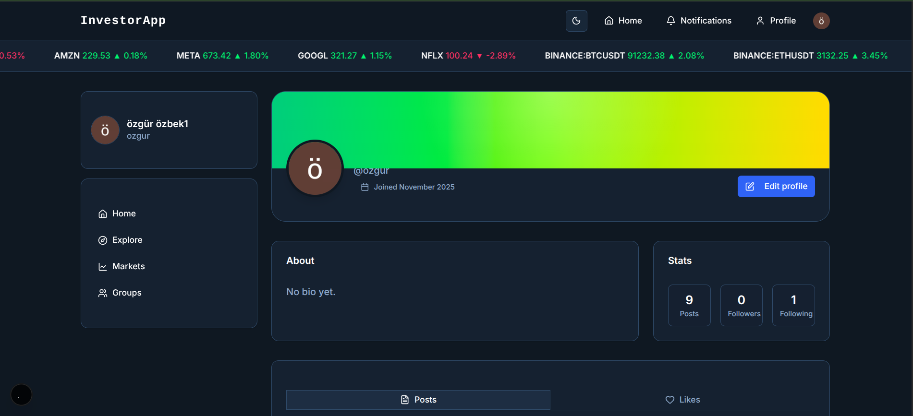

# InvestorApp — Social Investing Feed with Live Markets

Investor-focused social media platform where traders share ideas, follow markets, and engage around live price movements.

## Overview

InvestorApp is the capstone project for the MIT Emerging Talent (ELO 2) program – Track 2. It blends the familiar feed and interaction patterns of Twitter/Facebook with investor-centric features: market tickers, themed groups, and real-time reactions to price action. The goal is to demonstrate full-stack web skills and deliver a portfolio-ready, production-style product.

## Key Features

- User auth and profiles powered by Clerk (sign up, sign in, basic profile data).
- Global feed of investor posts with create, edit, and delete flows.
- AI Assistant: An integrated AI assistant that explains market data, summarizes posts, recommends content, and helps users interact with the platform through a natural chat interface.
- Explore Page: Discover trending posts, top investors, and popular market topics.
- Market Page: View real-time tickers, stock/crypto data, and market insights.
- Likes and unlikes to surface popular ideas.
- (Optional placeholder) Comments/replies to keep discussions threaded.
- Groups/topics to follow tickers, themes, or communities.
- Real-time or frequently refreshed ticker bar with ~30 stock and crypto pairs.
- Basic notifications/activity indicators.
- Responsive UI tuned for desktop and mobile.

## Screenshots

- Feed view:  
  
- Explore / Discover:  
  
- Groups and discussions:  
  
- Market dashboards:  
  
- Notifications and activity:  
  
- Profile view:  
  

## Tech Stack

- Next.js (App Router) + React
- TypeScript/JavaScript
- Prisma ORM
- PostgreSQL on Neon
- Clerk for authentication and user management
- Tailwind CSS with shadcn/ui primitives and Radix UI components
- React Query for client data fetching/caching
- ESLint, Prettier, and Turbopack/Next tooling for DX

## Architecture / High-Level Design

- **Front-end**: Next.js App Router with React components, Tailwind styling, and responsive layouts. Client data fetching uses React Query where appropriate.
- **Back-end**: Server actions and API routes handle post CRUD, likes, groups, and market ticker integrations.
- **Database**: PostgreSQL (Neon) accessed via Prisma schema/migrations.
- **Auth**: Clerk manages sessions, user profiles, and secure access control across server/client boundaries.

## Getting Started

### Prerequisites

- Node.js 18+ and npm or pnpm
- PostgreSQL database (e.g., Neon)
- Clerk account/keys for authentication
- Environment variables configured (see below)

### Installation

```bash
git clone <repo-url>
cd investorapp
npm install       # or pnpm install
```

### Run the development server

```bash
npm run dev       # or pnpm dev
# app runs at http://localhost:3000
```

### Database migrations with Prisma

```bash
npm run prisma:migrate   # if you add a script, otherwise use:
npx prisma migrate dev
npx prisma generate
```

Ensure `DATABASE_URL` points to your Neon database before running migrations.

## Environment Variables

Create a `.env` file with values for:

- `DATABASE_URL` – PostgreSQL connection string (Neon).
- `CLERK_PUBLISHABLE_KEY` / `NEXT_PUBLIC_CLERK_PUBLISHABLE_KEY` – Clerk publishable key for client.
- `CLERK_SECRET_KEY` – Clerk secret key for server-side auth.
- `NEXT_PUBLIC_CLERK_SIGN_IN_URL`, `NEXT_PUBLIC_CLERK_SIGN_UP_URL` – Auth route overrides.
- `NEXT_PUBLIC_CLERK_SIGN_IN_FALLBACK_REDIRECT_URL`, `NEXT_PUBLIC_CLERK_SIGN_UP_FALLBACK_REDIRECT_URL` – Post-auth redirects.
- `FINNHUB_KEY` or equivalent market data key for ticker updates.
- `UPLOADTHING_TOKEN` – if using UploadThing for media.

## Deployment

- Deploy the Next.js app on Vercel; set environment variables in the project settings.
- Use Neon for PostgreSQL with pooled connections and TLS.
- Run `prisma migrate deploy` during build or via CI/CD to keep schema in sync.

## Project Goals

- Showcase full-stack web development capabilities end-to-end.
- Build an investor-focused product that could be used in production.
- Integrate auth, database, real-time market data, and modern UI/UX patterns.
- Serve as a public-facing portfolio artifact for recruiting and collaboration.

## Roadmap / Future Work

- Deeper analytics on post engagement and ticker sentiment.
- Rich notifications (mentions, follows, price alerts).
- Advanced search and filtering by tickers, sectors, and tags.
- Watchlists and personalized ticker dashboards.
- Media uploads for charts and research attachments.
- Accessibility and performance hardening (Lighthouse/axe audits).

## Acknowledgements

- Built as part of the MIT Emerging Talent (ELO) program – Track 2 Capstone Project.
- Thanks to the open-source ecosystem around Next.js, Prisma, Clerk, Tailwind, and Radix UI.
